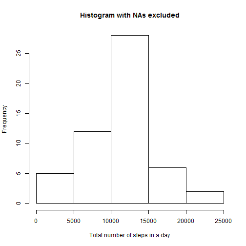
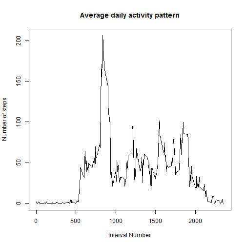
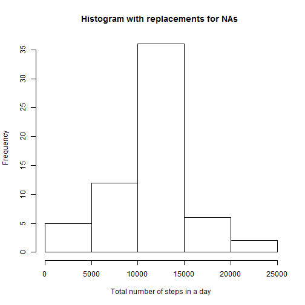

R markdown file for PeerAssessment 1 of Reproducible Research
==============================================================
This R markdown file will read in data in a file called "activity.csv"
There are three columns in the data file :steps, date and interval.


## Setting the global echo option to TRUE
======================================

```r
    opts_chunk$set(echo= TRUE, results ="asis")
```

## Loading the data
=================


```r
RawData<-read.csv("activity.csv")
```

## Processing the data
===================

```r
PData<-RawData
#Determining the total number of rows in original data set
NROW<-nrow(PData)
# Dealing with the dates
PData$date<-as.character(PData$date)
PData$date<-as.Date(PData$date,"%Y-%m-%d")
#Getting the unique dates
UDates<-unique(PData$date)
#Getting the number of days
NODs<-length(UDates)
# Converting to the corresponding day
PData$Day<-weekdays(PData$date)
# Steps and Interval
PData$steps<-as.numeric(PData$steps)
PData$interval<-as.numeric(PData$interval)
# Removing the NAs
PMData<-na.omit(PData)
```

## Plots corresponding to the loaded data
============================================

### 1.Histogram of total Number of Steps taken in a day & Numerical values of Mean and Median
=============================================================================================
Histogram is plotted by omitting the missing values  
Mean and Median is calculated by omitting the missing values


```r
  #Plotting the histogram of the total number of steps taken each day
  TotalHist<-tapply(PMData$steps,PMData$date,sum)
  hist(TotalHist,main="Histogram with NAs excluded",xlab='Total number of steps in a day')
```

 

```r
  #Mean of the steps excluding the NAs
  MeanStepsWONA <-mean(na.omit(PData$steps))
  MeanStepsWONA  
```

[1] 37.38

```r
  #Median of the steps excluding the NAs
  MedianStepsWONA<-median(na.omit(PData$steps))
  MedianStepsWONA
```

[1] 0

### 2.Average daily activity pattern
=============================================

```r
  UIDs<-unique(PData$interval)
  LengthUIDS<-length(UIDs)
  AvgDate<-tapply(PMData$steps,PMData$interval,mean)
  RefMatrix<-data.frame(UIDs,AvgDate)
  RefMatrix$AvgDate<-as.numeric(RefMatrix$AvgDate)
  plot(UIDs,AvgDate,type="l",main="Average daily activity pattern",xlab="Interval Number",
       ylab="Number of steps")
```

 

```r
  #The five minute interval having the maximum value for the average number of steps
  MaxAvgIndex<-which.max(as.numeric(AvgDate))
  MaxAvgInterval<-UIDs[MaxAvgIndex]
  #5 minute interval having the max average number of steps
  MaxAvgInterval
```

[1] 835
  

### 3.Inputting missing values
=============================================
a.Total number of missing values in the dataset  

```r
NumberNA<-sum(is.na(PData))
#Number of missing values
NumberNA   
```

[1] 2304

b.Filling in the missing values and creating a new Data Set  s
  

```r
#Missing value is replaced by the average of the corresponding 5 minute interval
PM2Data<-PData
for (i in 1:NROW){
  if(is.na(PM2Data$steps[i]))
    {
            PM2Data$steps[i]<-AvgDate[match(PM2Data$interval[i],UIDs)]
    }
}
```
c.Histogram, mean and median of new data set  

```r
  NewTotalHist<-tapply(PM2Data$steps,PM2Data$date,sum)
  hist(NewTotalHist,main="Histogram with replacements for NAs ",xlab='Total number of steps in a day')
```

 

```r
  #Mean of the steps excluding the NAs
  NewMeanSteps<-mean(PM2Data$steps)
  NewMeanSteps  
```

[1] 37.38

```r
  #Median of the steps excluding the NAs
  NewMedianSteps<-median(PM2Data$steps)
  NewMedianSteps
```

[1] 0

### 4.Difference in activity patterns on wwekdays and weekends
===========================================================


